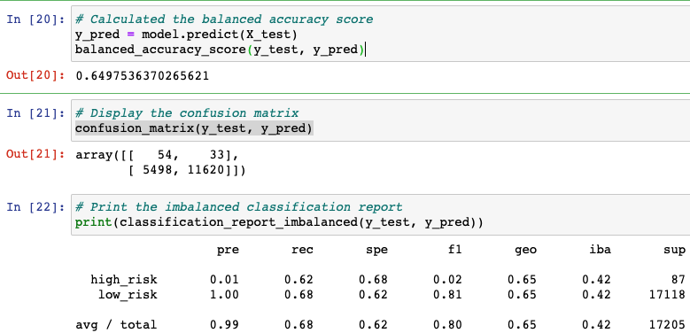
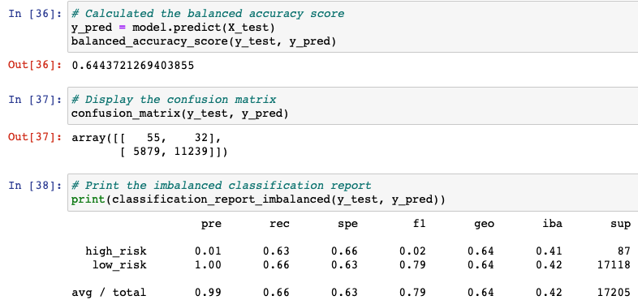

# Credit_Risk_Analysis

## Overview of the loan prediction risk analysis:

For this challenge, we have been asked to create a machine learning model to help determine credit card risk. While using the credit card credit dataset from LendingClub and the imbalanced-learn and scikit-learn libraries, we will: 1) build and evaluate models using resampling, 2) oversample the data using the RandomOverSampler and SMOTE alrogithms and undersample using the ClusterCentroids algorithms, 3) use a combinatorial approach using the SMOTEENN algorithm, and 4) compare the machine learning models that reduce bias and predict credit risk.

## Results:
### Naive Random Oversampling
- Balanced Accuracy Score: 0.6497536370265621 (64.98%)
- High/Low Precision: 0.01 (1%) and 1.00 (100%)
- High/Low Recall: 0.62 (62%) and 0.68 (68%)

### Smote Oversampling
- Balanced Accuracy Score: 0.6443721269403855 (64.44%)
- High/Low Precision: 0.01 (1%) and 1.00 (100%)
- High/Low Recall: 0.63 (63%) and 0.66 (66%)

### Random Undersampling
- Balanced Accuracy Score: 0.5292150629907619 (52.92%)
- High/Low Precision: 0.01 (1%) and 1.00 (100%)
- High/Low Recall: 0.61 (61%) and 0.45 (45%)

